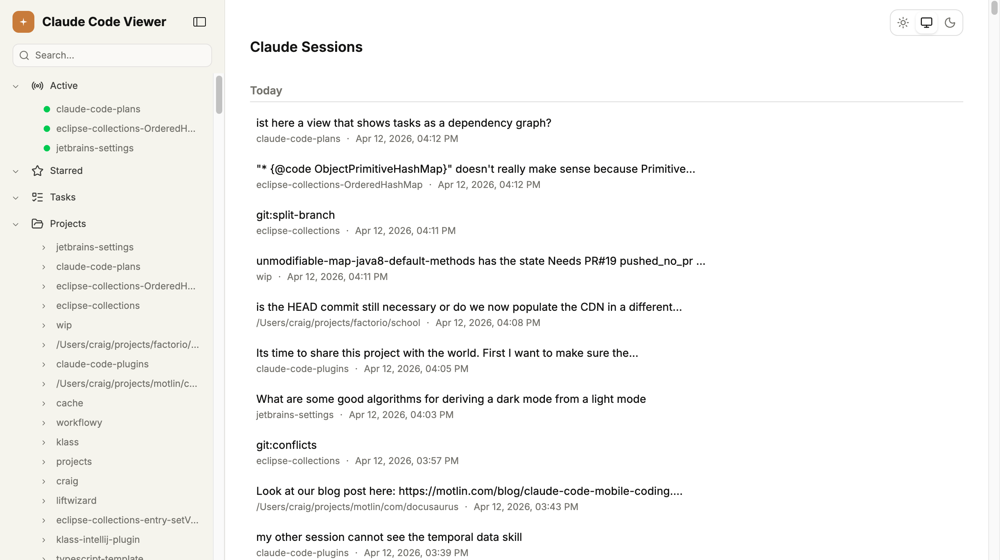
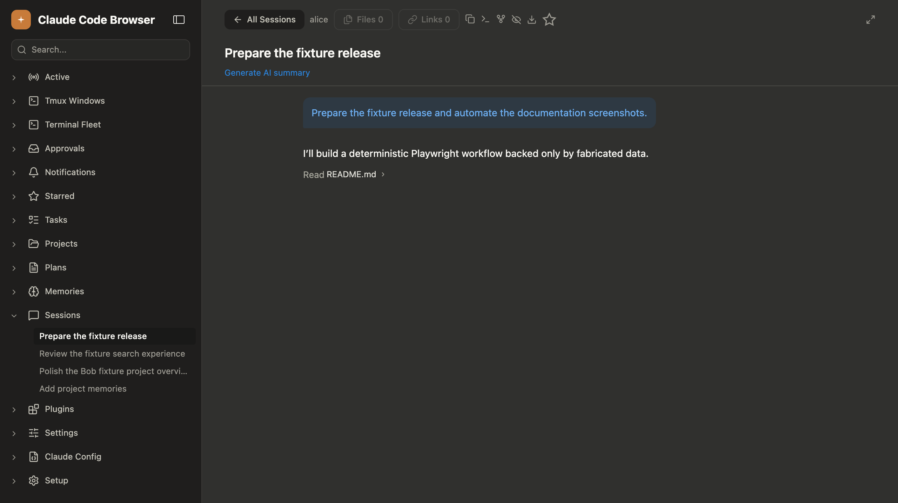
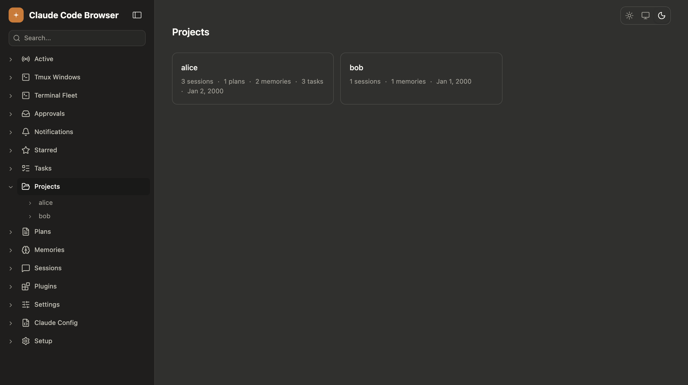
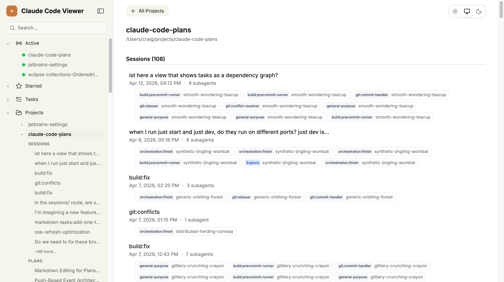
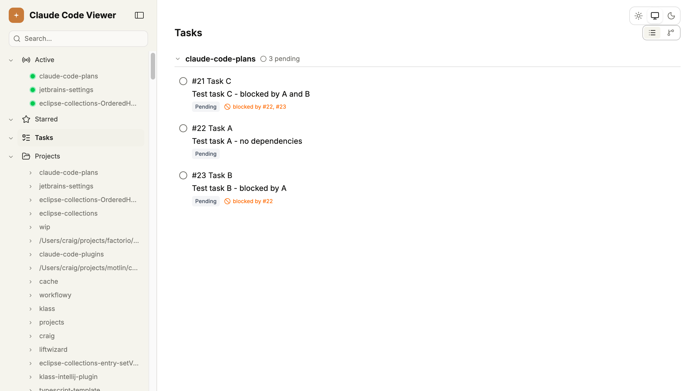
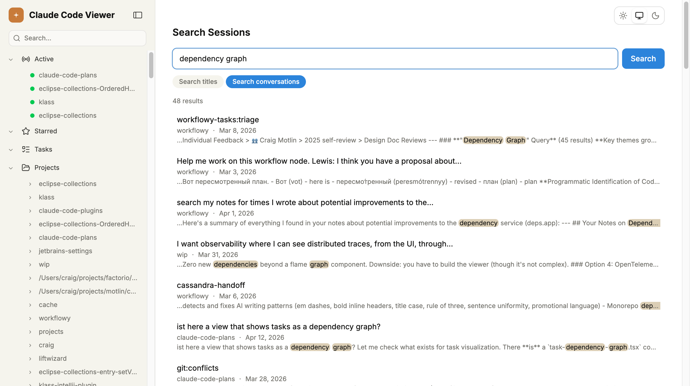

# Claude Code Viewer

A local web UI for browsing your [Claude Code](https://docs.anthropic.com/en/docs/claude-code) data: sessions, plans, memories, tasks, and plugins. It reads directly from `~/.claude/` and displays everything in a searchable, syntax-highlighted interface with live updates.



## Why

Claude Code stores everything as flat files: JSONL session logs, markdown plans, JSON task files, memory documents. They're scattered across `~/.claude/projects/`, `~/.claude/plans/`, `~/.claude/tasks/`, and `~/.claude/commands/`. Some are useful to browse, but none are easy to read directly.

This project indexes those files into SQLite and serves them through a TanStack Start app. Sessions render with syntax-highlighted code blocks, collapsible tool calls, and thinking blocks. Plans render as markdown. Everything updates in real-time via SSE when files change on disk.

## Features

- **Sessions** -- Browse all sessions across projects with summaries, timestamps, and message counts. Active sessions show a green dot indicator and poll for updates.



- **Session detail** -- Full conversation replay with syntax-highlighted code (Shiki), ANSI terminal output rendering, collapsible tool calls with duration, thinking blocks, and user avatars.
- **Projects** -- See all your Claude Code projects with session counts, plan links, memories, and tasks grouped together.



- **Project detail** -- Drill into a project to see its sessions with subagent trees, linked plans, memories, and tasks.



- **Plans** -- Browse and edit plan markdown files with live preview.
- **Memories** -- View all project memories grouped by project, with markdown rendering.
- **Tasks** -- View tasks across all projects with status badges and dependency information. Toggle between list view and dependency graph.



- **Search** -- Full-text search across session titles or conversation content (FTS5).



- **Plugins** -- Browse installed plugins, their commands, skills, hooks, and agents.
- **Starred sessions** -- Star important sessions for quick access.
- **Live updates** -- File watcher + SSE pushes changes to the browser as they happen.
- **Dark/light/system theme** -- Responds to OS preference changes in real-time.

## Quick Start

```sh
npm install
npm run dev
```

The server starts at `http://localhost:3000` by default.

## Production

Build and run as a persistent service:

```sh
npm run build
npm run start
```

Or use `just`:

```sh
just start         # build + run production server
just dev           # run dev server with hot reload
```

Set `PORT` to change the port (default: `3000`).

### launchd (macOS)

To run as a background service that starts on login:

```sh
just launchd-install   # install and start the service
just logs              # tail the server logs
just launchd-uninstall # stop and remove the service
```

## Tech Stack

- [TanStack Start](https://tanstack.com/start) + React 19 + Vite -- SSR framework
- [SQLite](https://sqlite.org/) via better-sqlite3 + [Drizzle ORM](https://orm.drizzle.team/) -- indexed data layer with FTS5
- [Tailwind CSS](https://tailwindcss.com/) -- styling
- [Shiki](https://shiki.style/) -- syntax highlighting
- [chokidar](https://github.com/paulmillr/chokidar) -- file watching for live updates

## Development

```sh
just dev          # start dev server
just test         # run tests (vitest)
just precommit    # run all checks (lint, format, build, typecheck, test)
```
