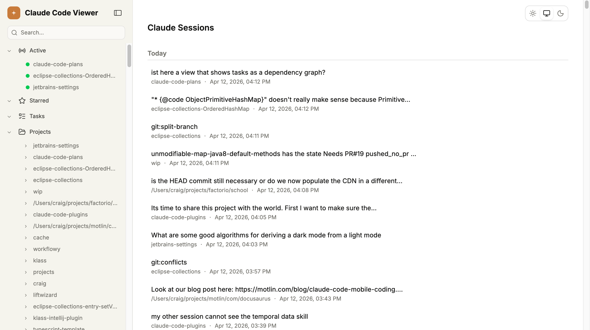

# Claude Code Browser

A local-only web UI for Claude Code, with a feature set similar to the Remote Control session experience in [claude.ai/code](https://claude.ai/code). The web server and Claude Code sessions run on the same machine. It also provides tools for inspecting and editing local files, including plan Markdown files, memory Markdown files, and `settings.json`.



## Features

- Browse and search sessions across projects, with formatted conversations, tool calls, and live updates.
- Inspect and edit local plans, memories, and settings.
- Browse project tasks and installed plugins, and pin sessions for quick access.

## Quick Start

```sh
pnpm install
pnpm dev
```

Open [localhost:7526](http://localhost:7526). The app reads Claude Code data from `~/.claude/` on the server's machine. Set `PORT` to change the default port.

## Production

```sh
pnpm build
pnpm start
```

Or use `just start` to build and run the server in the background, and `just stop` to stop it.

## Development

Built with TanStack Start, React, and SQLite.

```sh
just dev       # start the dev server
just test      # run tests
just verify    # run all checks
```
